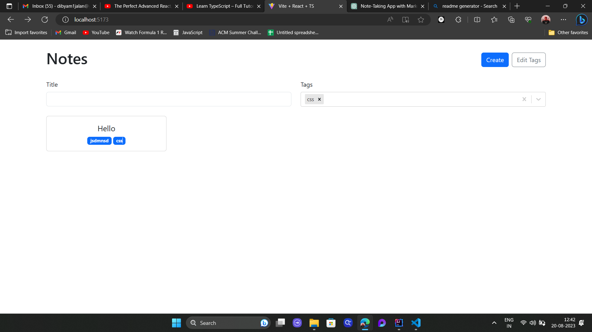

# Note-Taking App with React, TypeScript, and Vite

Welcome to the Note-Taking App! This is a simple web application built using React, TypeScript, and Vite. The app allows you to create, edit, and organize your notes using Markdown. You can also categorize your notes using tags for easy organization and retrieval.

## Features

- **Markdown Support:** Write your notes using Markdown to format text, add headers, lists, links, and more.
- **Create and Edit Notes:** Easily create new notes and edit existing ones to keep track of your thoughts and ideas.
- **Tagging:** Categorize your notes by adding tags to them. This makes it easier to group related notes together.
- **Search:** Use the search functionality to quickly find specific notes or tags.
- **Responsive Design:** The app is designed to work seamlessly across various devices and screen sizes.

## Deployment

The Note-Taking App is deployed and accessible online. You can use the app by visiting the following link: [Live Demo](https://your-deployment-link.com)

## Project Structure

The project structure follows a common React application setup, with some additional directories for better organization:

- **`src/`**: This is where the main source code of the app resides.
- **`public/`**: Contains static assets that are publicly accessible, like images or fonts.
- **`vite.config.js`**: Vite configuration file for customizing the build process.

## Contributing

Contributions are welcome! If you find any issues or have suggestions for improvements, please feel free to open an issue or submit a pull request.

## License

This project is licensed under the [MIT License](LICENSE).

---

Happy note-taking! If you have any questions or need further assistance, don't hesitate to reach out.

**Author:** Dibyam Jalan 
**Email:** dibyam1jalan@gmai.com  
**Project Repository:** [note-taking-app](https://github.com/your-username/note-taking-app)
